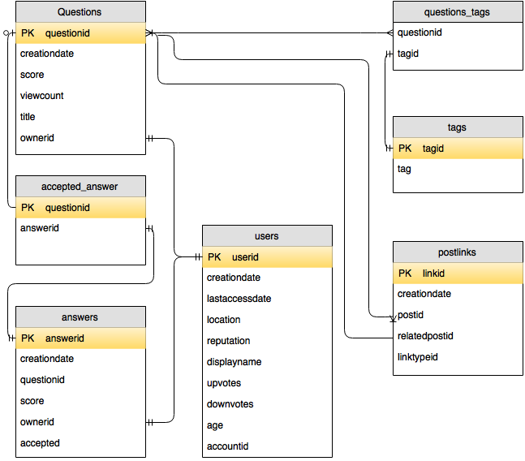

## Introduction
### About me

#### Background
Experience as a data manager, programmer, and trainer (not a statistician, but I dabble). Most of my DB experience is with open source software. Other tools I use are spreadsheets, Stata, R, Python, and command line tools (including vi).

#### Contact
Harrison Dekker   
Library Data Lab   
189 Doe Library   
hdekker@berkeley.edu

### Objectives
Get experience working with SQL within R.

## Relational Database
The SQL standard has been around a long time. I would argue that the main reason for this is that it provides an effective way to model and implement 'business logic'. The open source options like MySQL and PostgreSQL are relatively easy to install maintain and have helped perpetuate the popularity of SQL. 

In today's bootcamp, we'll use data from Stackoverflow. I need to give credit to this blog post for giving me the idea to use this data and for code samples. The raw data can be downloaded from here but it's not necessary to do so now. If you want to build the database, you'll need a working Postgresql server. All the code is available on Github. 

Attribution: The idea of using this data (and some of the code) came from http://jkunst.com/r/what-do-we-ask-in-stackoverflow/ which I found via R-Bloggers.

**Challenge:**  
Working with a partner, take a look at stats.stackexchange.com and think about some analysis you might want to do with the data you see on the pages. 

## Sample Database
To write SQL queries in R you first need to establish a connection to the database. A good practice is to not put usernames and passwords in your code, particularly if you use a public GitHub or otherwise share your code. One way to do this is to use environment variables. To set environment variables you'll need to create a .Renviron file in your R home directory. You should be able to figure out where that is by looking in your RStudio preferences. You can create the .Renviron in RStudio or another text editor. It should look something like this.

```bash
# PostgresSQL settings
PGSERVER="server_url"
PGUSER="username"
PGPASSWD="password"
```

You'll need to restart RStudio to read those variables. After that you should be able to run the following code.

```{r eval=FALSE}
#install.packages("RPostgreSQL")
library("RPostgreSQL")
dbhost <- Sys.getenv("PGSERVER")
dbuser <- Sys.getenv("PGUSER")
dbpasswd <- Sys.getenv("PGPASSWD")
drv <- dbDriver("PostgreSQL")
con <- dbConnect(drv, 
                 dbname = "stackoverflow", 
                 host = dbhost, 
                 port = 5432, 
                 user = dbuser, 
                 password = dbpasswd)
```

### Data model


### Normal form review
1. No Repeating Elements or Groups of Elements
2. No Partial Dependencies on a Concatenated Key
3. No Dependencies on Non-Key Attributes

## Queries
### SQL review
This workshop will assume you're familiar with basic database structure and terminology. It also assumes the basic SQL syntax for retrieving data from a table, selecting columns, filtering rows, sorting data. This should look familiar to you:

```SQL
SELECT title, score, viewcount
FROM questions
WHERE ownerid = 99575;
```

To run this query in R, do something like this:

```{r eval=FALSE}
source("dbconn.R")
dbGetQuery(con, "SELECT title, score, viewcount
FROM questions
WHERE ownerid = 99575")
```

But usually you'll want to capture the results in a data frame like this:

```{r eval=FALSE}
source("dbconn.R")
df <- dbGetQuery(con, "SELECT title, score, viewcount
FROM questions
WHERE viewcount > 5000")
```

TIP: With a largish database like this one, you can play it safe and do a count before running a query.
```{r eval=FALSE}
source("dbconn.R")
dbGetQuery(con, "SELECT count(*)
FROM questions
WHERE viewcount > 5000")
```

OR, you can limit the output.
```{r eval=FALSE}
source("dbconn.R")
dbGetQuery(con, "SELECT ownerid, title
FROM questions
WHERE viewcount > 5000
LIMIT 25")
```

**Challenge**
How many answers did the the question "Free statistical textbooks" receive. (Don't worry if you don't know how to do this in a single query, we'll get to that shortly)


Understanding database structure and terms Retrieving data from a table •	Selecting columns •	Sorting Data Filtering Rows •	Using logical operators •	Using list operators •	Using string operators Using Calculations •	Using date functions •	Using number functions •	Using string functions Summarizing Data •	Using aggregate functions •	Creating subtotals Joining Tables • Understanding basic relationships •	Creating joins •	Using advanced joins

### Joins
The three most common are INNER, OUTER, and FULL.

Inner joins take a form like this
```SQL
SELECT column1, column2
FROM table1 t1 INNER JOIN t2
ON t1.id_column = t2.id_column
WHERE ...
```
With our data, if we wanted to see the usernames of those who answered a specific post we can run this. Note that in this example the table aliases aren't required because there's no ambiguity about what tables the columns are associated, but it's a good habit to use them.
```SQL
SELECT u.displayname
FROM answers a INNER JOIN users u
ON a.ownerid = u.userid
WHERE a.questionid = 6896;
```
TASK: Let's run this in RStudio. 

**CHALLENGE:**    
Listing the tags associated with a given post involves joining three tables. The syntax is intuitive. Simply add another JOIN clause after the ON condition. Write a query to list the titles and tags associated with questions with the id's 4200, 4500, 10001. Hint: use an IN clause in your WHERE condition.

Outer joins take the same form but the result sets contain rows where there was no match. It's helpful to draw a diagram to understand the LEFT/RIGHT condition.

In this example we'll get a list of all users who've never posted a question, order it by displayname, and show only the first 25 results.

```SQL
SELECT displayname 
FROM questions q RIGHT OUTER JOIN users u 
ON q.ownerid = u.userid
WHERE q.ownerid is NULL  
ORDER BY displayname
LIMIT 25
```
We used a right outer join because users is on the right side of the join condition and we wanted to include all users even when there was no match.

**CHALLENGE:**  
How many questions tagged with 'random-forest' were unanswered? (combines inner and outer joins)


Another frequently used query involves the group by clause. For example, this query lists the top 100 tags used.
```SQL
SELECT tag, count(tag) as n
FROM questions_tags qt INNER JOIN tags t
ON qt.tagid = t.tagid
GROUP BY tag
ORDER BY n DESC
LIMIT 100
```
It's also possible to filter results on the calculated field using a HAVING clause. We'll run the same query, but filter it instead of showing the top 100.
```SQL
SELECT tag, count(tag) as n
FROM questions_tags qt INNER JOIN tags t
ON qt.tagid = t.tagid
GROUP BY tag
HAVING count(tag) = 100
```
Note that in the having clause the function was used, rather than the label 'n'. This is required.

**Challenge**  
What is the displayname of the user with the most "accepted answers" and how many does he/she have?

### Subqueries
```SQL
SELECT answerid, ownerid, score
FROM answers
WHERE score > (
 SELECT AVG (score)
 FROM answers
)
```

Another common form of subquery uses an IN construct. 
```SQL
SELECT displayname
FROM users
WHERE userid IN (
 SELECT q.ownerid
 FROM questions q INNER JOIN answers a 
 ON q.ownerid = a.ownerid
)
```
 
 **Challenge**  
 Create a frequency list of the tags used in the top 100 most answered questions.

## Functions
[Functions and operators](http://www.postgresql.org/docs/9.3/static/functions.html)


## Performance
Demonstrate the EXPLAIN commmand. This [document](https://wiki.postgresql.org/wiki/Introduction_to_VACUUM,_ANALYZE,_EXPLAIN,_and_COUNT) is a good starting point.  

## Abstraction
Examine the code used to generate the sample database. Here's the code for creating several tables.

```{r eval=FALSE}
# Read posts.xml and create the questions, questions_tags, answers, and tags tables

library("xml2")
library("dplyr")
library("stringr")
library("RPostgreSQL")

rm(list = ls())
dbhost <- Sys.getenv("PGSERVER")
dbuser <- Sys.getenv("PGUSER")
dbpasswd <- Sys.getenv("PGPASSWD")
drv <- dbDriver("PostgreSQL")
con <- dbConnect(drv, 
                 dbname = "stackoverflow", 
                 host = dbhost, 
                 port = 5432, 
                 user = dbuser, 
                 password = dbpasswd)
file <- "original_data/stats/Posts.xml"
dat <- file(description = file, open = "r")
invisible(readLines(con = dat, n = 2))
max_iters <- 5000
actual_iter <- 0
chunk_size <- 500
total_posts <- 0
total_questions <- 0
last.rowid <- 0
while (TRUE) {
  
  actual_iter <- actual_iter + 1
  if (actual_iter %% 1000 == 0) {
    message("iter ", actual_iter)
    message("total_posts ", total_posts)
    message("total_questions ", total_questions)
  }
  
  tmplines <- readLines(con = dat, n = chunk_size, encoding = "UTF-8")
  
  if (length(tmplines) == 0) {
    message("bye!")
    break
  } 
  
  if (str_detect(tmplines[length(tmplines)], "</posts>")) {
    message("Yay last chunk!")
    tmplines <- tmplines[-length(tmplines)]
  }
  
  total_posts <- total_posts + length(tmplines)
  
  x <- read_html(paste(tmplines, collapse = ""))
  
  rows <- x %>% xml_find_one("body") %>% xml_find_all("row")
  
  posttypeids <- x %>%  xml_find_all("body") %>% xml_find_all("row") %>% xml_attr("posttypeid")

  # build and save the 'questions' table  
  qrows <- rows[posttypeids == "1"]
  
  total_questions <- total_questions + length(rows)
  
  df <- data_frame(questionid = qrows %>% xml_attr("id"),
                   creationdate = qrows %>% xml_attr("creationdate"),
                   score = qrows %>% xml_attr("score"),
                   viewcount = qrows %>% xml_attr("viewcount"),
                   title = qrows %>% xml_attr("title"),
                   ownerid = qrows %>% xml_attr("owneruserid"),
                   tags = qrows %>% xml_attr("tags"))
	df$questionid <- as.numeric(df$questionid)			   
	df$creationdate <- format(df$creationdate, format="%Y-%m-%d %H:%M:%S" )
	df$score <- as.numeric(df$score)
	df$viewcount <- as.numeric(df$viewcount)
	df$ownerid <- as.numeric(df$ownerid)
	
	
	dbWriteTable(conn = con, name = "questions", as.data.frame(df[,c(1:6)]),
              row.names = FALSE, append = TRUE)

	# parse the tags out from the questions and save in the questions_tags table  
  df2 <- df %>% select(questionid, tags) %>% group_by(questionid) %>% do({
    data_frame(tag = str_split(.$tags, "<|>") %>% unlist() %>% setdiff(c("")))
  }) %>% ungroup()
  df2$questionid <- as.numeric(df2$questionid)
  
  # create a row id that to use as primary key
  start <- last.rowid + 1
  end <- last.rowid + nrow(df2)
  df2$rowid <- c(start:end)
  last.rowid <- end
  
  # rename the columns
  names(df2) <- c("questionid", "tag", "rowid")
  
  # write the data frame to the db
  dbWriteTable(conn = con, name = "questions_tags", as.data.frame(df2),
               row.names = FALSE, append = TRUE)
  
# build the 'answers' table
  arows <- rows[posttypeids == "2"]
  
  df3 <- data_frame(answerid = arows %>% xml_attr("id"),
                   questionid = arows %>% xml_attr("parentid"),
                   creationdate = arows %>% xml_attr("creationdate"),
                   score = arows %>% xml_attr("score"),
                   ownerid = arows %>% xml_attr("owneruserid"))
  
  df3$answerid <- as.numeric(df3$answerid)			   
  df3$creationdate <- format(df3$creationdate, format="%Y-%m-%d %H:%M:%S" )
  df3$score <- as.numeric(df3$score)
  df3$questionid <- as.numeric(df3$questionid)
  df3$ownerid <- as.numeric(df3$ownerid)
  
  dbWriteTable(conn = con, name = "answers", as.data.frame(df3),
               row.names = FALSE, append = TRUE)
}
close(dat)

### Modify some default data types and add primary key and indices

 # 'questions_tags'
dbGetQuery(con, "ALTER TABLE questions_tags ALTER COLUMN questionid TYPE integer;")
dbGetQuery(con, "ALTER TABLE questions_tags ADD PRIMARY KEY (rowid)")
dbGetQuery(con, "CREATE INDEX ON questions_tags (questionid)")
dbGetQuery(con, "CREATE INDEX ON questions_tags (tagid)")

# 'questions'
dbGetQuery(con, "ALTER TABLE questions ALTER COLUMN questionid TYPE integer;")
dbGetQuery(con, "ALTER TABLE questions ALTER COLUMN score TYPE integer;")
dbGetQuery(con, "ALTER TABLE questions ALTER COLUMN viewcount TYPE integer;")
dbGetQuery(con, "ALTER TABLE questions ADD PRIMARY KEY (questionid)")
dbGetQuery(con, "CREATE INDEX ON questions (ownerid)")

# 'answers'
dbGetQuery(con, "ALTER TABLE answers ALTER COLUMN answerid TYPE integer;")
dbGetQuery(con, "ALTER TABLE answers ALTER COLUMN questionid TYPE integer;")
dbGetQuery(con, "ALTER TABLE answers ALTER COLUMN score TYPE integer;")
dbGetQuery(con, "ALTER TABLE answers ALTER COLUMN ownerid TYPE integer;")
dbGetQuery(con, "ALTER TABLE answers ADD PRIMARY KEY (answerid)")
dbGetQuery(con, "CREATE INDEX ON answers (ownerid)")
dbGetQuery(con, "CREATE INDEX ON answers (questionid)")

### Create the 'tags' table
 # grab the tags via a query
df4 <- dbGetQuery(con, "select distinct tag 
                  from questions_tags
                  order by tag")

 # add an id field
df4$tagid <- c(1:nrow(df4))

 # add to the db
dbWriteTable(conn = con, name = "tags", as.data.frame(df4),
             row.names = FALSE, append = TRUE)

 # add a column to hold a tagid
dbGetQuery(con, "ALTER TABLE questions_tags ADD COLUMN tagid integer")

 # populate the new column with tagids (this is apparently the postgres way to do it)
dbGetQuery(con,"UPDATE questions_tags SET tagid = t.tagid
           FROM tags as t
           WHERE questions_tags.tag = t.tag")

 # add a primary key
dbGetQuery(con, "ALTER TABLE tags ADD PRIMARY KEY (tagid)")

 # index the tags
dbGetQuery(con, "CREATE INDEX ON tags (lower(tag))")

# remove the now unnecessary tag column in questions_tags
dbGetQuery(con, "ALTER TABLE questions_tags DROP COLUMN tag")

dbDisconnect(con)

```

Other possible activities:
* PostgreSQL installfest
* Modify the database by adding more data (comments, question text, etc.)
* ?

## Addenda

### Next steps
Any interest in a SQL working group? 

### List of R packages used/mentioned in this class
[RPostgreSQL](https://cran.r-project.org/web/packages/RPostgreSQL/index.html)  
[sqldf](https://cran.r-project.org/web/packages/sqldf/index.html)  
[dplyr](https://cran.r-project.org/web/packages/dplyr/index.html)  

### Miscellaneous Postgresql stuff
[PostgreSQL wiki](https://wiki.postgresql.org/wiki/Main_Page)  
[Postgresql Documentation](http://www.postgresql.org/docs/9.3/static/index.html)  
