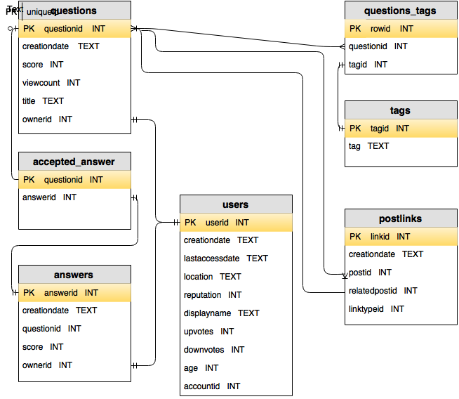

## Introduction
### About me

#### Background
Experience as a data manager, programmer, and trainer (not a statistician, but I dabble). Most of my DB experience is with open source software. Other tools I use are spreadsheets, Stata, R, Python, and command line tools (including vi).

#### Contact
Harrison Dekker
Library Data Lab
189 Doe Library
hdekker@berkeley.edu

### Objectives
Mauris blandit aliquet elit, eget tincidunt nibh pulvinar a. Curabitur aliquet quam id dui posuere blandit.

### Other stuff
Lorem ipsum dolor sit amet, consectetur adipiscing elit. Donec sollicitudin molestie malesuada. Vivamus magna justo, lacinia eget consectetur sed, convallis at tellus. Cras ultricies ligula sed magna dictum porta.

## Relational Database
(high level stuff - go into normalization, etc later). Say something about Postgresql and the SQL standard.

In today's bootcamp, we'll use data from Stackoverflow. I need to give credit to this blog post for giving me the idea to use this data and for code samples. The raw data can be downloaded from here but it's not necessary to do so now. If you want to build the database, you'll need a working Postgresql server. All the code is available on Github.

**Challenge:**
Working with a partner, take a look at stats.stackexchange.com and think about some analysis you might want to do with the data you see on the pages. 

## Sample Database
To write SQL queries in R you first need to establish a connection to the database. A good practice is to not put usernames and passwords in your code, particularly if you use a public GitHub or otherwise share your code. One way to do this is to use environment variables. To set environment variables you'll need to create a .Renviron file in your R home directory. You should be able to figure out where that is by looking in your RStudio preferences. You can create the .Renviron in RStudio or another text editor. It should look something like this.

```bash
# PostgresSQL settings
PGSERVER="server_url"
PGUSER="username"
PGPASSWD="password"
```

You'll need to restart RStudio to read those variables. After that you should be able to run the following code.

```{r eval=FALSE}
library("RPostgreSQL")
dbhost <- Sys.getenv("PGSERVER")
dbuser <- Sys.getenv("PGUSER")
dbpasswd <- Sys.getenv("PGPASSWD")
drv <- dbDriver("PostgreSQL")
con <- dbConnect(drv, 
                 dbname = "stackoverflow", 
                 host = dbhost, 
                 port = 5432, 
                 user = dbuser, 
                 password = dbpasswd)
```

### Data model


### Schema

## Queries
### SQL review
This workshop will assume you're familiar with basic database structure and terminology. It also assumes the basic SQL syntax for retrieving data from a table, selecting columns, filtering rows, sorting data
Understanding database structure and terms Retrieving data from a table •	Selecting columns •	Sorting Data Filtering Rows •	Using logical operators •	Using list operators •	Using string operators Using Calculations •	Using date functions •	Using number functions •	Using string functions Summarizing Data •	Using aggregate functions •	Creating subtotals Joining Tables • Understanding basic relationships •	Creating joins •	Using advanced joins


Donec rutrum congue leo eget malesuada. Vivamus suscipit tortor eget felis porttitor volutpat. Mauris blandit aliquet elit, eget tincidunt nibh pulvinar a. Curabitur non nulla sit amet nisl tempus convallis quis ac lectus. Quisque velit nisi, pretium ut lacinia in, elementum id enim. Quisque velit nisi, pretium ut lacinia in, elementum id enim. Lorem ipsum dolor sit amet, consectetur adipiscing elit. Praesent sapien massa, convallis a pellentesque nec, egestas non nisi. Donec rutrum congue leo eget malesuada. Nulla quis lorem ut libero malesuada feugiat.

## Performance
Cras ultricies ligula sed magna dictum porta. Lorem ipsum dolor sit amet, consectetur adipiscing elit. Nulla porttitor accumsan tincidunt. Praesent sapien massa, convallis a pellentesque nec, egestas non nisi. Donec rutrum congue leo eget malesuada. Praesent sapien massa, convallis a pellentesque nec, egestas non nisi. Quisque velit nisi, pretium ut lacinia in, elementum id enim. Donec rutrum congue leo eget malesuada. Donec rutrum congue leo eget malesuada. Donec rutrum congue leo eget malesuada.

## Abstraction
Vivamus magna justo, lacinia eget consectetur sed, convallis at tellus. Proin eget tortor risus. Vestibulum ac diam sit amet quam vehicula elementum sed sit amet dui. Pellentesque in ipsum id orci porta dapibus. Curabitur non nulla sit amet nisl tempus convallis quis ac lectus. Pellentesque in ipsum id orci porta dapibus. Cras ultricies ligula sed magna dictum porta. Mauris blandit aliquet elit, eget tincidunt nibh pulvinar a. Pellentesque in ipsum id orci porta dapibus. Nulla porttitor accumsan tincidunt.

## Addenda
### How to build the sample database
### List of R packages used/mentioned in this class
### Miscellaneous Postgresql stuff
[Postgresql Documentation](http://www.postgresql.org/docs/9.3/static/index.html)